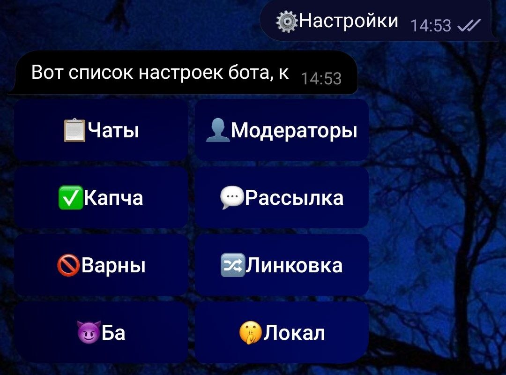
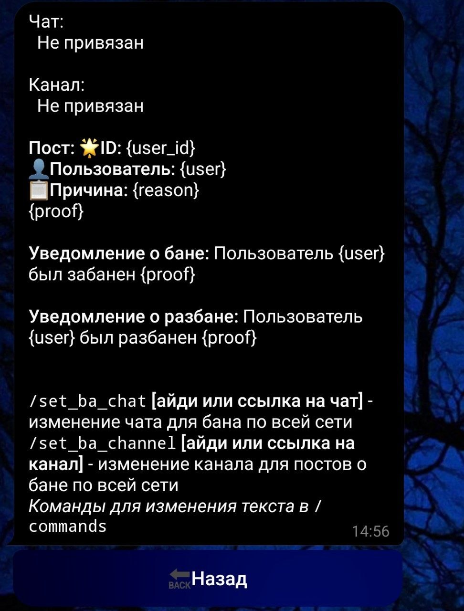

# TG Administrator

Многофункциональный Telegram-бот для администрирования групп и сетей чатов.

TG Administrator предоставляет централизованную систему модерации, глобальные блокировки пользователей, автоматические рассылки, защиту через капчу и гибкую настройку служебных сообщений. Проект разработан для сообществ, использующих несколько Telegram-групп и нуждающихся в единой системе управления.


---

## 📸 Скриншоты

### Меню настроек



### Настройка рассылок


### Настройка варнов


### Настройка банов по сети



---

## ✨ Возможности

### 🛡️ Модерация пользователей

Полный набор инструментов для администраторов и модераторов:

* Бан и разбан пользователей в отдельных чатах.
* Временные и постоянные муты.
* Выдача и снятие предупреждений.
* Исключение пользователей из чата.
* Работа по ID, username или ответу на сообщение.
* Система прав для модераторов.

---

### 🌐 Глобальная система банов

Позволяет модерировать сразу всю сеть связанных чатов.

Возможности:

* Глобальный бан пользователя.
* Глобальный разбан пользователя.
* Тихие глобальные блокировки без уведомлений.
* Хранение причины блокировки.
* Поддержка ссылок на доказательства нарушения.
* Автоматическая публикация информации о банах в отдельный канал.
* Автоматическое распространение блокировок между чатами сети.

---

### 🔗 Система линковки чатов

Бот позволяет объединять несколько Telegram-групп в единую сеть.

Возможности:

* Назначение главного чата для линковки.
* Централизованное управление сетевыми настройками.
* Общая система модерации между чатами.

---

### 📢 Автоматические рассылки

Система периодических сообщений для участников сообщества.

Возможности:

* Создание рассылок из любого сообщения.
* Настройка интервала отправки.
* Изменение параметров существующих рассылок.
* Автоматическая публикация по расписанию.

---

### 🤖 Капча для новых участников

Защита сообщества от спама и ботов.

Возможности:

* Проверка новых пользователей.
* Настраиваемые тексты сообщений.
* Настраиваемые кнопки капчи.
* Автоматическая обработка результатов проверки.

---

### ⚙️ Гибкая настройка сообщений

Большинство текстов можно изменять прямо через команды бота без редактирования кода.

Настраиваются:

* Сообщения капчи.
* Сообщения открытия чата.
* Сообщения закрытия чата.
* Уведомления о глобальных банах.
* Посты для канала банов.
* Сообщения о разблокировках.

Поддерживаются переменные:

| Переменная  | Описание                 |
| ----------- | ------------------------ |
| `{user}`    | Упоминание пользователя  |
| `{user_id}` | ID пользователя          |
| `{reason}`  | Причина блокировки       |
| `{proof}`   | Ссылка на доказательства |

---

## 📋 Команды

### 💖 Модерация

| Команда                                    | Описание                        |
| ------------------------------------------ | ------------------------------- |
| `/ba [id] [причина] [доказательства]`      | Глобальный бан пользователя     |
| `/unba [id]`                               | Глобальный разбан пользователя  |
| `/local [id]`                              | Тихий глобальный бан            |
| `/unlocal [id]`                            | Тихий глобальный разбан         |
| `/ban [id/username/reply]`                 | Бан пользователя в текущем чате |
| `/unban [id/username/reply]`               | Разбан пользователя             |
| `/mute [id/username/reply] [срок]`         | Выдача мута                     |
| `/unmute [id/username/reply]`              | Снятие мута                     |
| `/warn [id/username/reply] [причина]`      | Выдача предупреждения           |
| `/unwarn [id/username/reply] [количество]` | Снятие предупреждений           |
| `/kick [id/username/reply]`                | Исключение пользователя         |

---

### 💬 Рассылки

| Команда                         | Описание                     |
| ------------------------------- | ---------------------------- |
| `/add_dist [интервал]`          | Создание рассылки            |
| `/set_dist_int [id] [интервал]` | Изменение интервала рассылки |

---

### 🔀 Линковка

| Команда                  | Описание                    |
| ------------------------ | --------------------------- |
| `/set_linkto_chat [чат]` | Изменение чата для линковки |

---

### 😈 Глобальные баны

| Команда                   | Описание                            |
| ------------------------- | ----------------------------------- |
| `/set_ba_chat [чат]`      | Изменение чата для глобальных банов |
| `/set_ba_channel [канал]` | Изменение канала публикации банов   |

---

### 🌟 Настройка текстов

| Команда                   | Описание                               |
| ------------------------- | -------------------------------------- |
| `/set_close_text`         | Сообщение закрытия чата                |
| `/set_already_close_text` | Сообщение о уже закрытом чате          |
| `/set_open_text`          | Сообщение открытия чата                |
| `/set_already_open_text`  | Сообщение о уже открытом чате          |
| `/set_ba_post`            | Текст поста о глобальном бане          |
| `/set_ba_text`            | Текст уведомления о глобальном бане    |
| `/set_unba_text`          | Текст уведомления о глобальном разбане |

---

## 🏗️ Архитектура проекта

```text
tg_administrator/
├── alembic/
├── bot/
│   ├── handlers/
│   ├── middlewares/
│   ├── filters/
│   ├── keyboards/
│   ├── services/
│   ├── utils/
│   ├── database/
│   └── states/
├── config/
├── migrations/
├── main.py
└── requirements.txt
```

---

## 🚀 Установка

### 1. Клонирование репозитория

```bash
git clone https://github.com/kooflixy/tg_administrator.git
cd tg_administrator
```

### 2. Создание виртуального окружения

```bash
python -m venv venv
```

### 3. Установка зависимостей

```bash
pip install -r requirements.txt
```

### 4. Настройка переменных окружения

Создайте файл `.env`:

```env
DB_HOST = 
DB_PORT = 
DB_USER = 
DB_PASS = 
DB_NAME = 

TELETHON_API_ID = 
TELETHON_API_HASH = 

ADMIN_ID = 
DEVELOPER_ID = 

TG_BOT_API_TOKEN = 
PROXY_URL = 
```

### 5. Выполнение миграций

```bash
alembic upgrade head
```

### 6. Запуск

```bash
python main.py
```

---

## 🗄️ Используемые технологии

* Python 3
* aiogram 3.x
* Telethon
* PostgreSQL
* SQLAlchemy
* Alembic
* AsyncIO

---

## 🎯 Для кого создан проект

Проект подойдёт для:

* игровых сообществ;
* сетей Telegram-групп;
* образовательных проектов;
* тематических сообществ;
* крупных групп с командой модераторов.

---

## 📄 Лицензия

Проект распространяется по лицензии, выбранной владельцем репозитория.
